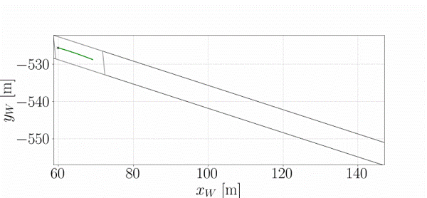
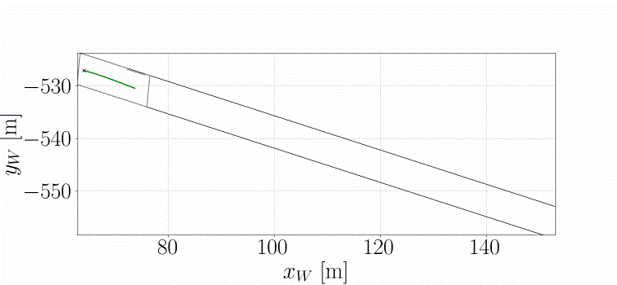
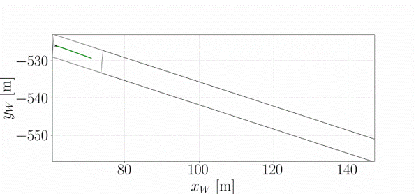
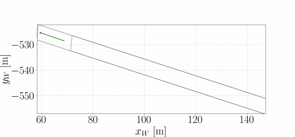
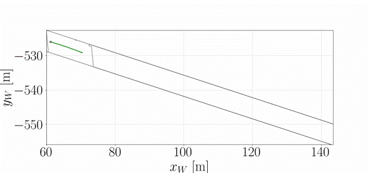
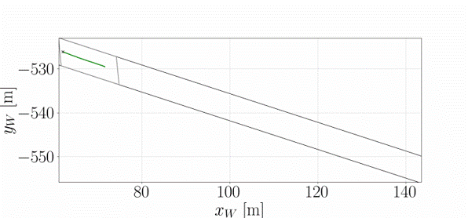
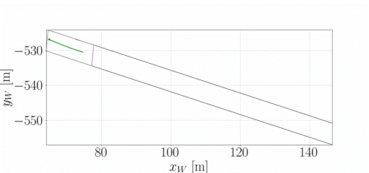
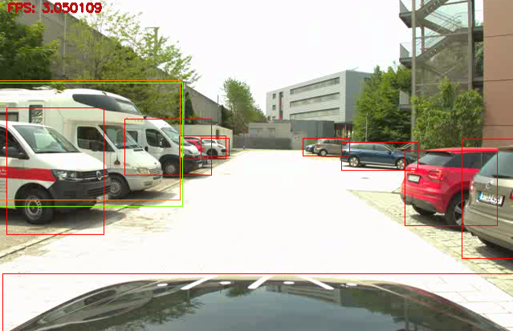
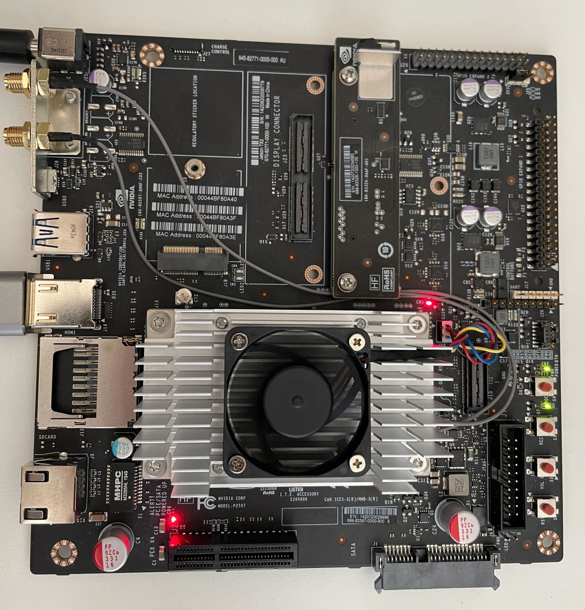

# Samuel Leitenmaier
Research Associate at [Technical University of Applied Sciences Augsburg](https://www.tha.de/)

**Contact:** samuel.leitenmaier@tha.de

# Biography

Samuel Leitenmaier received his B. Eng. in Computer Engineering and M. Sc. in Applied Research on Computer Science from the  [Technical University of Applied Sciences Augsburg](https://www.tha.de/).
He is currently a research associate at the [Driverless Mobility](https://github.com/DriverlessMobility) research group. His main focus lies on the strong interaction between motion planning and
scene understanding of autonomous vehicles with a special focus on heterogeneous computing architectures utilizing these.

# Research interests
- Autonomous Driving
- Motion Planning, Navigation, Scene Understanding
- Heterogeneous Computing with FPGAs
- Efficient Hardware / Software using SoC

# Publications

- **Towards Specialized Hardware for Autonomous Driving Functions: THAccelerated Motion Planner**. *IEEE International Conference on Robotics and Automation, RoboARCH: Robotics Acceleration with Computing Hardware and Systems*, 2025. [Abstract](https://drive.google.com/file/d/1I2Ff6ddKC1gLyRi1xga5TXx0z62XjFFI/view)
- **Autonomous Electric Race Car Inverter Development: Revving up the future with resource efficient drive technology**. *IEEE Electrification Magazine, vol. 11, no. 2*, 2023. [Article](https://ieeexplore.ieee.org/abstract/document/10143767)

# Projects
## THAMP: THAccelerated Motion Planner

This project developed as part of the [Driverless Mobility](https://github.com/DriverlessMobility) research group at Technical Univeristy of Applied Sciences Augsburg.

### Results

These results are part of HiL testing and real-world testing with a research vehicle. Four scenarios can be seen.

#### Straight Driving

| HiL | Real-world |
|:-----------------------------------------:|:-----------------------------------------:|
|  |  |

#### Parking Vehicle

| HiL | Real-world |
|:-----------------------------------------:|:-----------------------------------------:|
|  |  |

#### Overtaking

| HiL | Real-world |
|:-----------------------------------------:|:-----------------------------------------:|
|  |  |

#### Avoidance

| HiL | Real-world |
|:-----------------------------------------:|:-----------------------------------------:|
|  |  |

## Yolov4 Edge Object Detection: Jetson TX2 vs. Utlrascale MPSoC

Metrics are: FPS, W. On Jetson TX2 `jtop` was used to measure power consumption, on Ultrascale MPSoC `sysmon`was used.

| Detected cars on THA campus using FPGA|
|:-----------------------------------------:|
|  |

### Evaluation Hardware

| Jetson TX2 | UltraZed |
|:-----------------------------------------:|:-----------------------------------------:|
|  |  |

### Latency

| FPS    | Jetson TX2 | UltraZed
| -------- | ------- | -------
| Min  | 3.1 | 3.091
| Max | 3.4 | 3.202
| Avg    | 3.3 | 3.134

### Inference

| Power consumption [W]    | Jetson TX2 | UltraZed
| -------- | ------- | -------
| Inference Off  | 2.216 | 1.734
| Inference On | 9.955 | 2.641 
| Diff.    | 7.739 | 0.906 

## Formula Student Traction Inverter

### Hardware Interfaces
- [Motor Encoder Interface](https://github.com/samlei-research/endat_interface)
- [External Differntial ADC Interface](https://github.com/samlei-research/inverter_adc_interface)

### Software Interfaces:
- [Emdedded Linux CAN to AXI Interface](https://github.com/samlei-research/automatic_can_axi_mapper)

### Inverter Operating System 
- [Forked Uboot config](https://github.com/samlei-research/xlnx_uboot_custom)
- [Forked Xilinx Linux config](https://github.com/samlei-research/xilinx-linux_custom)

<!---
samlei-research/samlei-research is a ✨ special ✨ repository because its `README.md` (this file) appears on your GitHub profile.
You can click the Preview link to take a look at your changes.
--->
